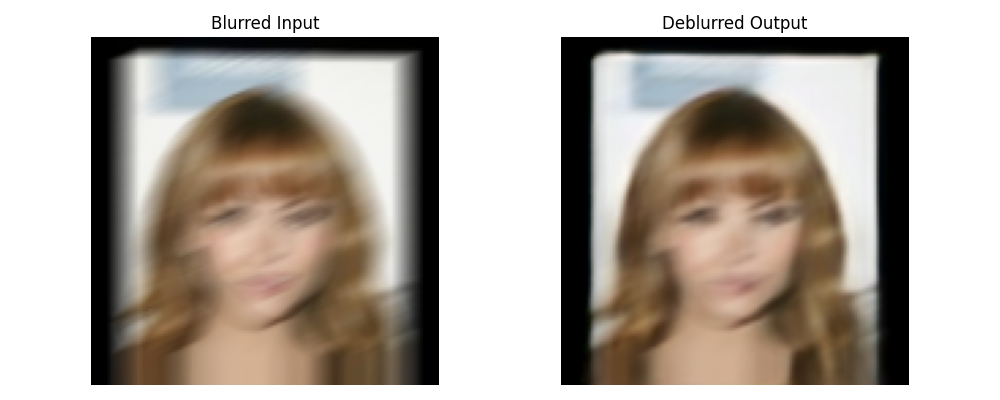

# KD Deblurring
**Real-time image deblurring via knowledge distillation using Restormer and a lightweight U-Net.**

This project presents a compact student model trained via offline knowledge distillation from a powerful transformer-based teacher (Restormer), optimized for fast and effective image sharpening in video conferencing scenarios.

The model achieves 0.84 SSIM and 26.8 PSNR on synthetic motion-blurred face and shared content datasets and runs at up to **39 FPS on an RTX 3050 GPU** and **25.9 FPS on an Intel i5 CPU**.

## Features

- **Knowledge Distillation**: Used a transformer-based Restormer model as the teacher to supervise a lightweight U-Net student network.
- **Offline Supervision Strategy**: To overcome hardware limitations, teacher outputs were precomputed and script to do the same is stored in the `precompute/` folder, enabling stable distillation at scale.
- **Blurred Dataset Construction**: Created a custom dataset of 5,571 face images from CelebA and Shared Content datasets, resized to 256×256 and synthetically blurred with motion and compression artifacts.
- **Model Export for Deployment**: The trained student model was exported to both **ONNX** and **OpenVINO IR**, making it deployable across multiple hardware targets.
- **Real-Time Performance**:
  - **39 FPS** on RTX 3050 GPU (128×128 input)
  - **25.9 FPS** on Intel i5 CPU (128×128 input)
  - **15.2 FPS** on Intel MacBook Pro (i7) (256×256 OpenVINO)
- **Lightweight Student Design**: Model is compact enough for real-time usage on modest hardware without GPU acceleration.
- **Quantitative Results**:
  - **Teacher**: SSIM > 0.91 (on precomputed targets)
  - **Student**: SSIM = 0.84, PSNR = 26.8 (at 20 epochs) - performance increases further at higher epochs
- **Inference Backends Supported**:
  - **PyTorch** (native)
  - **ONNXRuntime**
  - **OpenVINO**


## Installation & Setup

This project was developed and tested using **Python 3.10**. It is recommended to use a virtual environment to avoid conflicts with system packages.

### 1. Clone the repository

```bash
git clone https://github.com/your-username/KD-Deblurring.git
cd KD-Deblurring
````

### 2. Create and activate a virtual environment

```bash
python3.10 -m venv torch_env
source torch_env/bin/activate          # For macOS/Linux
# .\torch_env\Scripts\activate         # For Windows
```

### 3. Install dependencies

Upgrade `pip` and install the required Python packages:

```bash
pip install --upgrade pip
pip install -r requirements.txt
```

**Note**: This project uses the **CPU-only version of PyTorch** for compatibility across systems. If PyTorch fails to install or defaults to the wrong architecture, run:

```bash
pip install torch torchvision torchaudio --index-url https://download.pytorch.org/whl/cpu
```

You should now be ready to run inference using PyTorch, ONNXRuntime, or OpenVINO.


## Usage

This section provides instructions to run inference using the trained student model across different backends.


### 1. Run inference with PyTorch

```bash
python torch_inference.py --image_path path/to/image.jpg --output_path output/torch_output.jpg
````


### 2. Run inference with ONNXRuntime

```bash
python onnx_inference.py --image_path path/to/image.jpg --output_path output/onnx_output.jpg
```


### 3. Run inference with OpenVINO

```bash
python openvino_inference.py --image_path path/to/image.jpg --output_path output/openvino_output.jpg
```


### Notes:

* All inference scripts accept `--image_path` and `--output_path` as arguments.
* Default input resolution is **128x128**, to improve performance.
* Inference performance varies by backend and input resolution. Refer to the benchmarks section for FPS results.
* Sample inputs are not provided due to dataset restrictions. You may test using any face image resized to 128x128.


## Results / Benchmarks

### 1. **Quantitative Metrics**


> * Teacher Model (Restormer): SSIM > 0.91
> * Student Model (Lightweight U-Net): SSIM = 0.84, PSNR = 26.8 dB (at 20 epochs)

Note: Results are **likely to improve** with more training, this project was stopped at 20 Epochs due to computational constraints.


### 2. **Performance Benchmarks (FPS)**


| Backend       | Device         | Resolution | FPS   |
| ------------- | -------------- | ---------- | ----- |
| OpenVIN0      | RTX 3050 (GPU) | 128×128    | 39.0  |
| OpenVIN0      | Intel i5 CPU   | 128×128    | 25.9  |
| Benchmark App | Intel Mac (i7) | 128×128    | 26.88 |

Note: Performance may vary accross systems


### 3. **Visual Results**

Below is an output produced by the student model after deblurring a synthetically blurred face image:



## Dataset

The training data consisted of **5571 RGB images** created by combining:

- **CelebA Dataset**: A large-scale face attributes dataset with over 200K celebrity images.
- **Shared Content Dataset**: A generic open-source dataset used for diverse image content and can be found on Kaggle.

All images were:
- Resized to **256×256**
- Augmented with **synthetic motion blur** and **JPEG compression artifacts**
- Normalized to [0,1] for training

Due to compute constraints, only a **subset of the combined dataset** was used. These images were selected randomly to preserve diversity in facial structure and background content.

> The final dataset was used solely precomputation of teacher outputs and for training the student model. 

### Notes
- CelebA is publicly available for research at [CelebA Dataset](http://mmlab.ie.cuhk.edu.hk/projects/CelebA.html)
- Shared Content Dataset can be found on Kaggle.
- Dataset files are **not included** in this repository due and storage constraints.


## Model Architecture & Conversion

### Architecture Overview

- **Teacher Model**: [Restormer](https://github.com/swz30/Restormer) — a transformer-based model designed for high-quality image restoration.
- **Student Model**: A lightweight U-Net with reduced parameters, suitable for real-time inference.

The student was trained using **offline knowledge distillation**, where ground truth supervision came from the precomputed outputs of the teacher model that can be created with script stored in `precompute/`.

### Student Model: Lightweight U-Net
The student model is a compact U-Net variant designed for real-time performance, incorporating modern architectural enhancements:

Key Features:

**Multi-scale Input Fusion**: Combines original input with a downsampled version to help the model retain both local and contextual information early on.

**Encoder-Decoder Structure**: Three-level hierarchical feature extraction and reconstruction using:
  - Convolution blocks with BatchNorm + ReLU
  - MaxPooling in the encoder
  - Transposed convolutions in the decoder

**ECA Attention**: Efficient Channel Attention modules after every encoder/decoder block for improved channel-wise feature emphasis with minimal computational cost.

**Residual Output**: Final layer output is clamped to [0,1] range for normalized image generation


### Distillation Process

- Images were synthetically blurred using motion blur.
- Teacher outputs were generated ahead of training to reduce computational load.
- The student model was trained to minimize (0.3) L1 loss and (0.7) Distillation loss between its output and the teachers.
  

## Future Work & Limitations

### Limitations

- **Early Training Cutoff**: The student model was trained for only 20 epochs due to computational constraints. With more epochs, it is likely to achieve higher SSIM and PSNR.
- **Synthetic Blur Only**: The dataset used synthetic motion and compression blur. Performance on real-world webcam blur can vary and has not been quantitatively evaluated.
- **Resolution-Specific Performance**: The student model shows better FPS at 128×128 resolution, but there is a trade-off in output quality. Resolution adaptation logic is not currently implemented.
- **Single Image Inference**: The current pipeline supports single image input only. Batch inference and video stream support can significantly improve utility.


### Future Improvements

- **Extended Training**: Training for 100+ epochs with cosine annealing or warm restarts to improve generalization and fidelity.
- **Real-World Fine-Tuning**: Including webcam or smartphone blur samples to make the model more robust to natural degradation.
- **INT8 Quantization**: Post-training quantization using OpenVINO to further reduce model size and increase inference speed without compromising quality.
- **Live Deployment**: Wrapping the student model into a real-time video processing app using OpenCV or MediaPipe for direct webcam sharpening.
- **Edge Benchmarking**: Testing on low-power hardware like Raspberry Pi or Intel NCS2 for true edge-readiness.

## Acknowledgements & Citations

This project builds upon the work of several open-source contributors and research communities. Special thanks to the following:

### Teacher Model

- **Restormer**  
  *P. Zamir et al., “Restormer: Efficient Transformer for High-Resolution Image Restoration,” CVPR 2022*  
  GitHub: [https://github.com/swz30/Restormer](https://github.com/swz30/Restormer)


### Datasets

- **CelebA Dataset**  
  Provided by MMLAB, Chinese University of Hong Kong  
  [http://mmlab.ie.cuhk.edu.hk/projects/CelebA.html](http://mmlab.ie.cuhk.edu.hk/projects/CelebA.html)

- **Shared Content Dataset**  
  Used for general image diversity and to simulate content shared in vide oconferences


### Tools & Libraries

- PyTorch
- OpenVINO Toolkit
- ONNX & ONNXRuntime
- torchvision, torchmetrics
- tqdm, NumPy, OpenCV


This project was developed as part of the **Intel® Unnati Industrial Training Program**.


